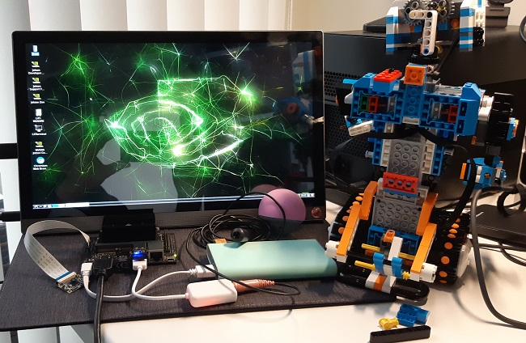

# LEGO Boost with NVIDIA Jetson Nano

This project combines the [LEGO Boost](https://www.lego.com/en-us/product/boost-creative-toolbox-17101)
with the [NVIDIA Jetson Nano 2GB](https://developer.nvidia.com/embedded/jetson-nano-2gb-developer-kit).
Using Bluetooth, the Jetson Nano will be able to control the [LEGO Movehub](https://www.lego.com/en-nl/product/move-hub-88006)
or the [LEGO Powered Up hub](https://www.lego.com/en-nl/product/hub-88009).

## LEGO Boost
In the summer of 2017, LEGO launched the "Boost" construction kit, enabling children to learn how to code by building a
toy robot. The central brick of the robot is the Move Hub. It has the following features:
* Bluetooth connectivity
* Two encoded motors
* Activation button
* Internal tilt sensor
* Light

In the LEGO Boost kit, the Move Hub can be connected with two peripheral components: 
* Interactive Motor
* Color & Distance Sensor
  * detects distance, motion and color, and can also function as a light.
  


## NVIDIA Jetson Nano 2GB
At the end of October 2020, NVIDIA introduced the Jetson Nano 2GB Developer Kit. It includes a Jetson Nano module with 2 GB
memory and delivers 472 GFLOPS of compute performance with a 128-core NVIDIA Maxwell GPU and 64-bit Quad-core Arm A57 CPU.
Using the USB ports of the Jetson Nano, we can also add extra devices, such as a camera, microphone and speaker.
The MIPI CSI-2 connector can also be used to add a camera.


> WARNING: **The heatsink gets hot!**

## Python and Artificial Intelligence
Normally, the LEGO Boost is controlled by a tablet app. Thanks to the 
[pylgbst Python library](https://github.com/undera/pylgbst) by Andrey Pokhilko, we can also use the Python language for controlling
the LEGO Boost.
The Python language is very popular in the Artificial Intelligence world. 
Regarding Artificial Intelligence, an interesting pylgbst demo is the [face tracking demo](https://www.youtube.com/watch?v=WUOa3j-6XfI&feature=youtu.be).
By combining the LEGO Boost with the Jetson Nano, we can leverage the GPU power for the more complex task of face recognition.

About the topic of Python and face recognition on the Jetson Nano, there are some interesting tutorial videos and articles:
1. [AI on the Jetson Nano LESSON 39: Face Recognition and Identification with OpenCV](https://www.youtube.com/watch?v=J9aQgl7LeIg&list=PLGs0VKk2DiYxP-ElZ7-QXIERFFPkOuP4_&index=39) (Paul McWhorther, May 2020)
1. [AI on the Jetson Nano LESSON 42: Recognizing and Identifying Faces from Live Video on OpenCV](https://www.youtube.com/watch?v=tF2u_ndYBuQ&list=PLGs0VKk2DiYxP-ElZ7-QXIERFFPkOuP4_&index=42) (Paul McWhorther, May 2020)
1. [AI on the Jetson Nano LESSON 53: Object Detection and Recognition in OpenCV](https://www.youtube.com/watch?v=3mo6vlz0qGo&list=PLGs0VKk2DiYxP-ElZ7-QXIERFFPkOuP4_&index=53) (Paul McWhorter, August 2020)
1. [Build a Face Recognition System for $60 with the New Nvidia Jetson Nano 2GB and Python](https://medium.com/@ageitgey/build-a-face-recognition-system-for-60-with-the-new-nvidia-jetson-nano-2gb-and-python-46edbddd7264) (Adam Geitgey, October 2020)
   1. [Github repo](https://github.com/ageitgey/face_recognition)
   1. [Face recognition demo with improved speed](https://github.com/ageitgey/face_recognition/blob/master/examples/facerec_from_webcam_faster.py)

The following demo has been very much inspired by the above tutorials.
For this demo, Python version 3.6.9 was used.

## Face recognition demo with Vernie
Due to the small size, Vernie the robot can easily carry the Jetson Nano on it's back.
By adding a few LEGO bricks from the LEGO Boost box, the Jetson Nano can be attached
and even be complemented with a Power bank carrier for standalone operation.

In this demo, Vernie will initially be trained with two face-images.
Any newly recognized face will be added to the list of known faces, by using the face encoding.
Vernie will ask for the name and record the name with a microphone.
When Vernie recognizes a face, it will greet and say the corresponding name.
Vernie will remember that name and not repeat it again.
When you wave your hand in front of Vernie, the latest name will be forgotten. 

### Demo video
[](https://youtu.be/sUXfhjZMqto)

### Instruction video
[](https://youtu.be/KKI2xkKXrQw)


### Extra required hardware
A few accessory hardware items are required for running the demo.



#### HDMI monitor
You need an HDMI monitor for starting up the demo from the desktop.

#### Bluetooth keyboard and mouse
A Bluetooth keyboard and mouse are recommended for ease-of-use.
This way, only plugging in the HDMI cable is needed for programming the robot.
Besides, the Jetson Nano 2GB only has three USB ports, which will be needed
by the following peripheral devices.

#### Wi-fi dongle
If not already provided, you need to get a Wi-fi dongle for remote ssh access or 
access to the Google Speech API's.

#### Bluetooth dongle
For connectivity with the LEGO Move Hub, you need a BLE (Bluetooth Low Energy) dongle.
This dongle is also used for the Bluetooth speaker, keyboard and mouse.
For this demo, a CSR 4.0 dongle was used. A Bluegiga dongle was not working on the Jetson Nano.

#### Microphone + adapter
For speech input, you can use a mini microphone with 3,5 mm jack in combination with
a USB adapter.

#### Camera
For this demo, the [IMX219-77](https://www.waveshare.com/imx219-77-camera.htm) Camera with 77° FOV was used.

#### Power bank
For standalone operation, the Jetson Nano needs a power bank or battery pack.
The Lego Boost itself is using 6 AAA (rechargeable) piles.
A power bank should have output 5V and 2,4A. 1,0A will still work.

#### Bluetooth speaker
For this demo, a mini Bluetooth speaker was used.
 
## Software installation
Now it's time to do some sudo and pip commands:
```
sudo apt-get update
sudo apt-get install python3-pip
pip3 install numpy
```

### pylgbst
For installing pylgbst on the Jetson Nano, do the following:

```
pip3 install -U pylgbst
pip3 install bluepy
```

### OpenCV
The Jetson Nano 2GB is provided with a pre-installed software package (JetPack 4.4).
One of the many AI libraries is [OpenCV](https://opencv.org/). By default, the OpenCV installation is not CUDA enabled:

```python
$ python3
>>> import cv2
>>> print(cv2.__version__)
4.1.1
>>> print(cv2.cuda.getCudaEnabledDeviceCount())
0
```

In this demo, OpenCV is only used for capturing images. For face recognition, we will use the face_recognition library
("The world's simplest facial recognition api").

### face_recognition and dlib

This library uses [dlib](http://dlib.net/), which is CUDA enabled by default

```
sudo apt-get install cmake libopenblas-dev liblapack-dev libjpeg-dev
sudo pip3 install Cython face_recognition
sudo pip3 install dlib
```
> The installation of dlib can take almost one hour on the Jetson Nano.

After installation, check whether the dlib library is CUDA enabled:
```python
$ python3
>>> import dlib
>>> dlib.DLIB_USE_CUDA
True
>>> print(dlib.cuda.get_num_devices())
1
```

### Speech recognition and text-to-speech
For this demo, the Google Cloud Speech API's have been used:
* [Speech-to-Text](https://cloud.google.com/speech-to-text)
* [Text-to-Speech](https://cloud.google.com/text-to-speech)

#### Speech recognition
For speech recognition, the library [SpeechRecognition](https://pypi.org/project/SpeechRecognition/) is used.
This library requires the [pyaudio](https://pypi.org/project/PyAudio/) library for microphone input.

```
sudo apt-get install portaudio19-dev python-pyaudio python3-pyaudio
sudo pip3 install pyaudio
sudo pip3 install SpeechRecognition
```

#### Text-to-speech
For text-to-speech, the library [gTTS](https://pypi.org/project/gTTS/) is used.
In order to play the sound on the Bluetooth speaker, follow the 
[Connecting Bluetooth Audio tutorial](https://developer.nvidia.com/embedded/learn/tutorials/connecting-bluetooth-audio).

```
sudo pip3 install gTTs
sudo apt-get install mpg123
sudo apt-get install flac
sudo apt-get install pulseaudio-module-bluetooth
```

Finally:
```
sudo reboot
```

## Usage
1. Connect the HDMI cable with the Jetson Nano
1. In the desktop, start the Bluetooth manager
1. Connect with the Bluetooth speaker
1. Open a terminal
1. Run the program with ```sudo python3 demo.py```
1. In the logging output, check whether the connection with the LEGO Boost was successful
   1. If the connection was not successful, quit the program with Ctrl+C and try again
1. For standalone operation, disconnect the HDMI cable
1. Enjoy the show!

Stop the program by:
1. Connecting the HDMI cable again
2. Enter Ctrl+C in the terminal
